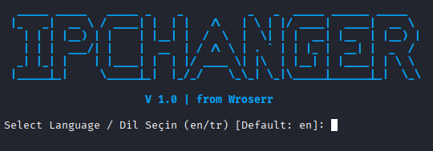

# 🛡️ IPChanger from Wroserr (Tor IP Rotator)

[English](#english) | [Türkçe](#turkish)

---

<a name="english"></a>
## US English

**IPChanger** is a high-security Python automation tool designed to rotate your public IP address through the Tor network. Unlike basic scripts, it features a professional **Kill Switch** mechanism to ensure zero data leaks by forcing all outgoing traffic through the secure Tor tunnel.



### 🌟 Key Features
- **Automated Rotation:** Automatically requests a new Tor identity every 60 seconds.
- **Advanced Kill Switch:** Configures `iptables` to block any traffic that isn't routed through Tor.
- **Multilingual Support:** Interactive language selection (EN/TR) on startup.
- **Professional ASCII UI:** Clean, color-coded console interface.
- **Safe Exit:** Automatically restores system firewall settings upon termination (Ctrl+C).

### 🛠️ Installation & Usage

1. **Install Tor Service:**
   ```bash
   sudo apt update && sudo apt install tor -y
2. **Configure Tor: Open /etc/tor/torrc and ensure these lines are active (uncommented):**
   ```PlainText
   ControlPort 9051
   CookieAuthentication 1
3. **Restart Tor:***
   ```bash
   sudo service tor restart
4. **Install Dependencies:**
   ```bash
   pip install -r requirements.txt
5. **Run as Root:**
   ```bash
   sudo python3 ipchanger.py

---

<a name="turkish"></a>
## TR Türkçe

**IPChanger**, halka açık IP adresinizi Tor ağı üzerinden periyodik olarak değiştiren, yüksek güvenlikli bir Python otomasyon aracıdır. Sıradan scriptlerin aksine, tüm giden trafiği güvenli Tor tüneline zorlayarak veri sızıntısını sıfıra indiren profesyonel bir **Kill Switch (Durdurma Anahtarı)** mekanizmasına sahiptir.

### 🌟 Temel Özellikler 
- **Otomatik Değişim**: Her 60 saniyede bir otomatik olarak yeni bir Tor kimliği talep eder.
- **Gelişmiş Kill Switch**: Tor üzerinden yönlendirilmeyen tüm trafiği engellemek için iptables ayarlarını yapılandırır.
- **Çok Dilli Destek**: Başlangıçta etkileşimli dil seçimi (EN/TR) sunar.
- **Profesyonel ASCII Arayüzü**: Temiz, renk kodlu konsol arayüzü.
- **Güvenli Çıkış**: Program kapatıldığında (Ctrl+C) sistem güvenlik duvarı ayarlarını otomatik olarak eski haline döndürür.

### 🛠️ Yükleme & Kullanım

1. **Tor Servisini Kurun:**
   ```bash
   sudo apt update && sudo apt install tor -y
2. **Tor Yapılandırması: /etc/tor/torrc dosyasını açın ve şu satırların başındaki # işaretini kaldırarak aktif edin:**
   ```PlainText
   ControlPort 9051
   CookieAuthentication 1
3. **Tor Servisini Yeniden Başlatın:***
   ```bash
   sudo service tor restart
4. **Gerekli Kütüphaneleri Yükleyin:**
   ```bash
   pip install -r requirements.txt
5. **Root Yetkisiyle Çalıştırın:**
   ```bash
   sudo python3 ipchanger.py
   
⚖️ Legal Disclaimer / Yasal Uyarı
```bash
EN: This tool is provided for educational and ethical security testing purposes only. The author (Wroserr) is not responsible for any misuse, illegal activities, or damages caused by this program. Use it at your own risk and in compliance with local laws.
TR: Bu araç sadece eğitim ve etik güvenlik testi amaçları için sunulmuştur. Yapımcı (Wroserr), bu programın kötüye kullanımından, yasa dışı faaliyetlerden veya programın sebep olabileceği zararlardan sorumlu tutulamaz. Kullanım sorumluluğu tamamen kullanıcıya aittir ve yerel yasalarla uyumlu kullanılmalıdır.

Author / Yapımcı: Wroserr
